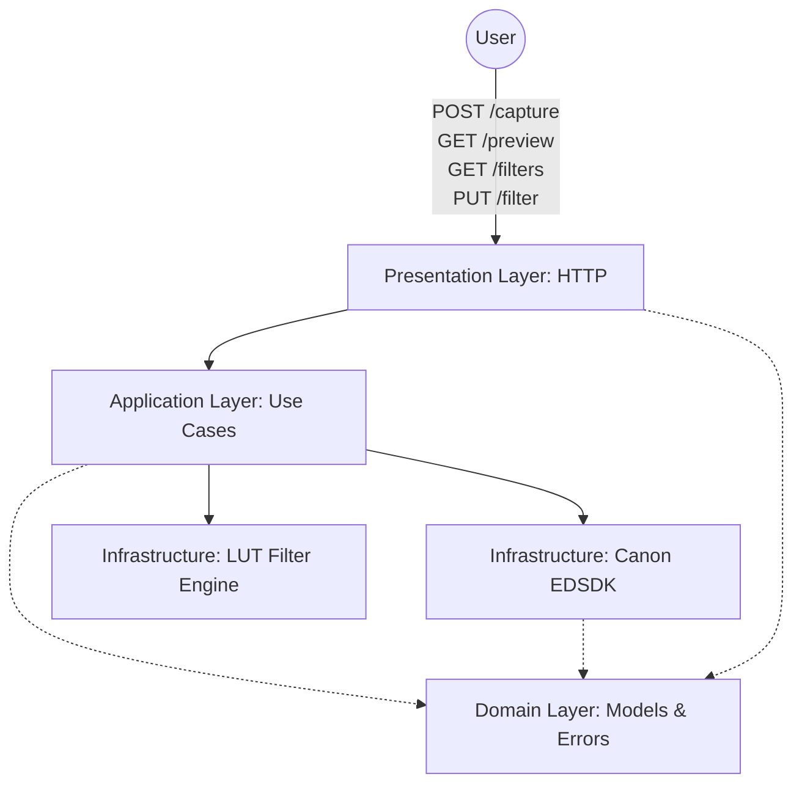
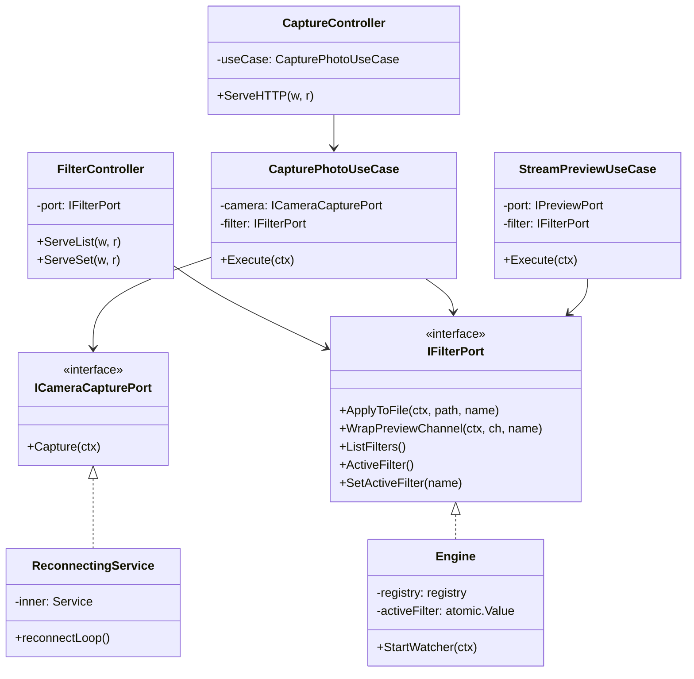
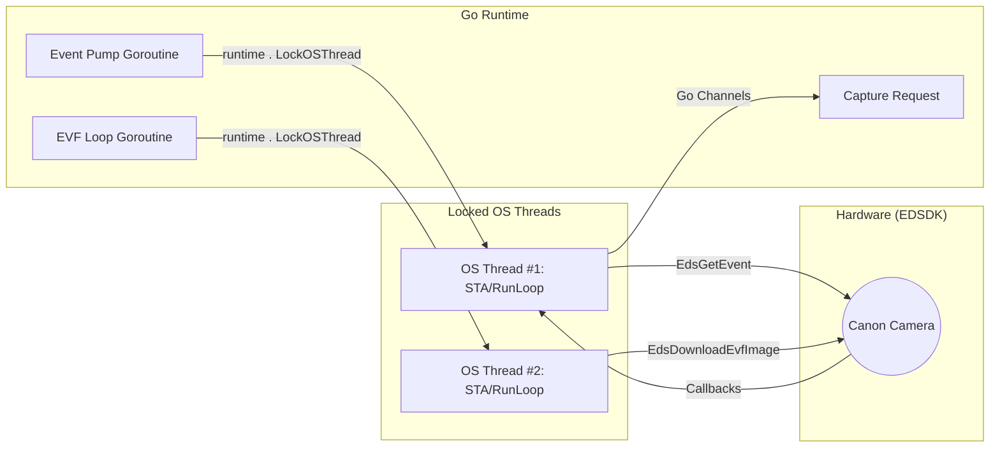
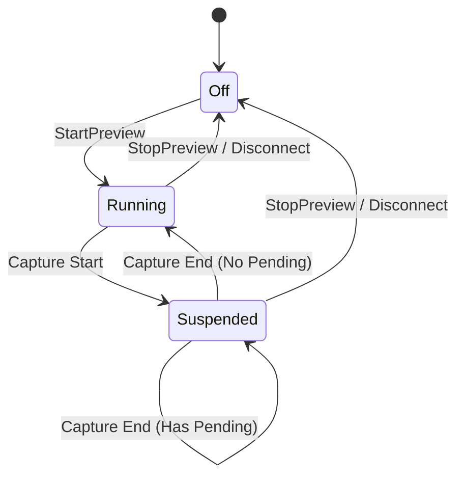
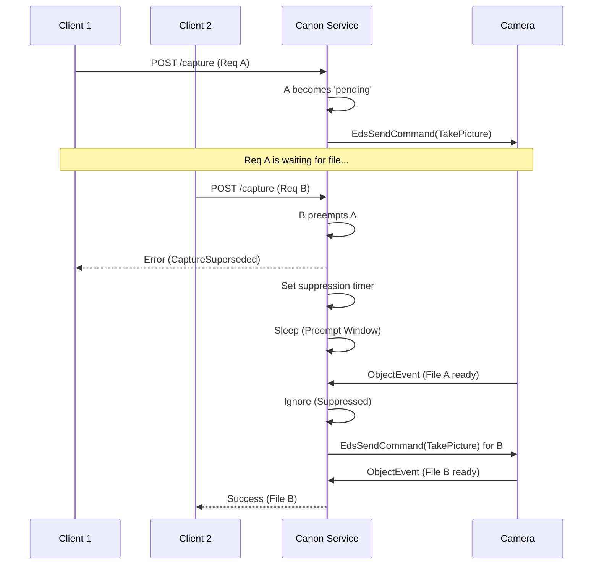
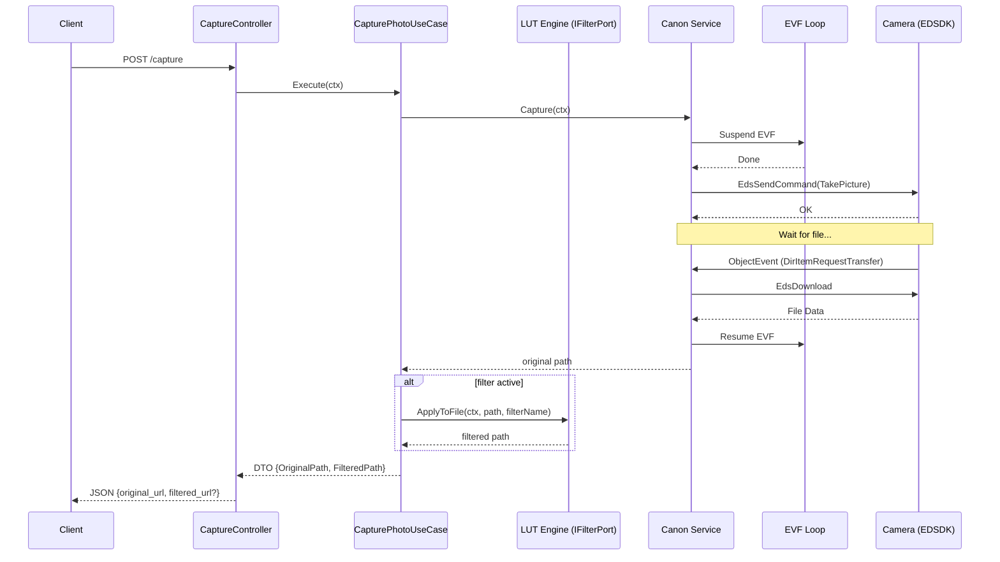
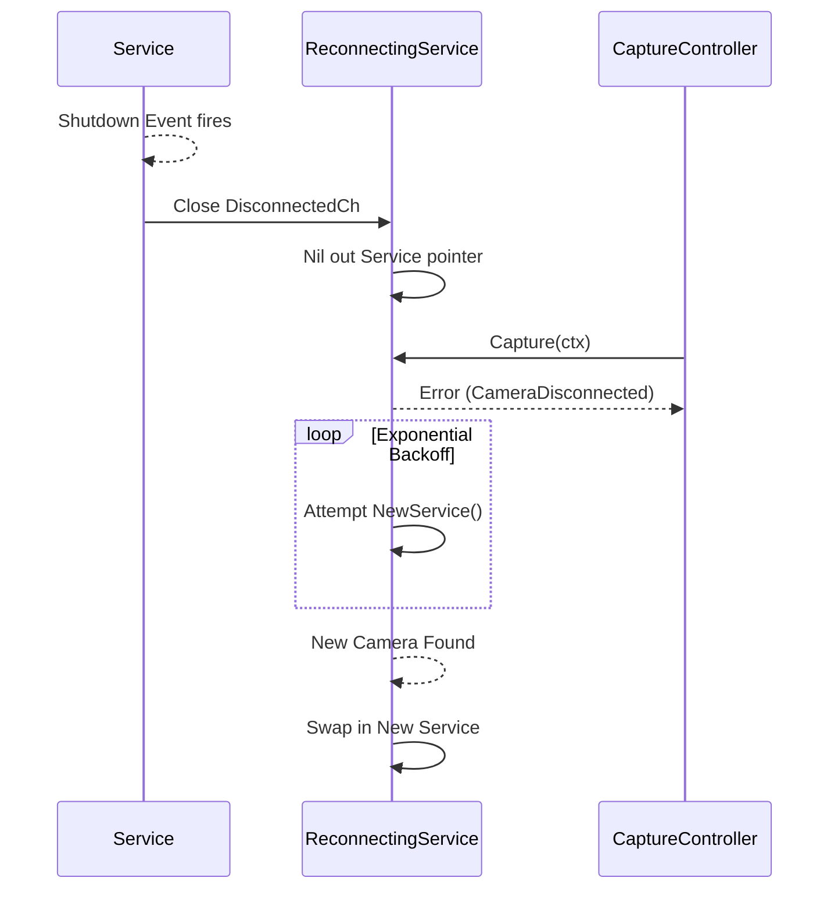

# System Architecture

This document describes the architecture of the **Photoboot-Picstop** backend, which interfaces with Canon cameras via
the EDSDK and applies real-time 3D LUT colour filters to both the live preview stream and captured photos.

## Architecture Overview

The system follows a clean, layered architecture with a clear separation of concerns, ensuring that the business logic (
Application) is isolated from external frameworks or hardware drivers (Infrastructure).



### Layer Responsibilities

- **Presentation (HTTP)**: Handles RESTful requests, parses input (e.g., `timeout_ms`), and maps domain errors to
  appropriate HTTP status codes. It uses a View Model pattern to decouple internal domain types from external JSON
  responses.
- **Application**: Contains the business orchestration logic. It defines **ports** (interfaces) like
  `ICameraCapturePort` and `IFilterPort` that the infrastructure layer must implement. This layer ensures that use cases
  remain agnostic of the underlying camera driver and image processing details.
- **Infrastructure (Canon)**: The "heavy lifting" layer for camera control. Implements camera commands using CGo and the
  Canon EDSDK. Manages the `ReconnectingService` wrapper, platform-specific threading (COM STA for Windows), and the
  callback-driven event pump.
- **Infrastructure (LUT)**: Pure-Go image processing. Loads Adobe `.cube` files at startup, applies trilinear
  interpolation per pixel, and hot-reloads the filter catalogue when files are added or removed.
- **Domain**: Pure Go logic containing value objects and sentinel errors.
    - `CaptureResult`: Value object representing the outcome of a capture.
    - Sentinel Errors: `ErrCaptureInProgress`, `ErrCaptureSuperseded`, `ErrShutterCommandTimeout`,
      `ErrCameraDisconnected`.

---

## Component Interaction

The interaction between components is managed through dependency injection, wired together in `cmd/server/main.go`.



---

## Filter Pipeline

### Overview

The filter pipeline slots between the application use cases and the HTTP presentation layer without touching the Canon
infrastructure. The key design decisions:

- **`nil` filter port = passthrough** — use cases accept `nil`; no feature flag needed.
- **Filter failure is non-fatal on capture** — if `ApplyToFile` fails, the original photo is still returned.
- **Original is never modified** — `ApplyToFile` writes `IMG_1234_filtered.JPG` alongside `IMG_1234.JPG`.
- **Active filter in `atomic.Value`** — preview goroutine reads it per frame; filter changes take effect on the next
  frame with no stream interruption or restart.

### 3D LUT Interpolation

Each pixel is mapped through the LUT using **trilinear interpolation** across the 8 nearest table vertices.
For a LUT of size N, the interpolation is:

```
floor(R*(N-1)) → r0,  frac → dr
floor(G*(N-1)) → g0,  frac → dg
floor(B*(N-1)) → b0,  frac → db

output = trilinear(corner_000..corner_111, dr, dg, db)
```

The bundled LUTs use **17×17×17** (4913 entries), which balances quality and file size. Standard `.cube` files at any
size from 2 to 256 are accepted.

### Hot-Reload

The `registry` polls the `filters/` directory every 5 seconds. New `.cube` files are loaded; deleted files are
unloaded. If the active filter is removed while the service is running, subsequent frames pass through unfiltered
automatically (the `registry.get` lookup returns `(nil, false)` and the goroutine passes the raw frame).

### Performance

| Path | Strategy |
|---|---|
| Preview (15–30 ms/frame) | Single goroutine per stream; `sync.Pool` recycles `image.NRGBA` buffers; JPEG quality 85 |
| Capture (full-res JPEG) | Row-striped across `GOMAXPROCS` goroutines; JPEG quality 95 |

---

## Specialized EDSDK Handling

The Canon EDSDK has strict requirements that influence the system's design:

### 1. The Threading Challenge: EDSDK vs. Go Runtime

The Canon EDSDK has extremely strict threading requirements that are inherently incompatible with the default Go
scheduler:

- **Thread Local Storage (TLS)**: Many SDK functions expect data stored in the thread's local storage. If a Go routine
  migrates from one OS thread to another (a standard behavior of the M:N scheduler), the SDK will fail with
  `EDS_ERR_SESSION_NOT_OPEN` or outright crash.
- **COM Apartment Model (Windows)**: On Windows, the SDK requires a **Single-Threaded Apartment (STA)**. This is a
  per-thread initialization that must be maintained as long as the SDK is in use.
- **RunLoops (macOS)**: macOS requires an active **CFRunLoop** to deliver events from the hardware to the application
  handlers.

### 2. Our Implementation: Binding Go to the Metal

To solve these issues, the system uses a combination of Go's `runtime` package and platform-specific C wraps:

- **`runtime.LockOSThread()`**: Every goroutine that interacts with the SDK (Event Pump, EVF Loop, Capture triggers)
  immediately calls this. This locks the goroutine to its current OS thread, preventing the scheduler from moving it and
  ensuring TLS remains valid.
- **Platform Abstractions (`withPlatformThreading`)**:
    - **Windows**: Calls `CoInitializeEx(COINIT_APARTMENTTHREADED)`.
    - **macOS**: Prepares the thread for framework-based calls.
- **Dedicated Hardware Threads**:
    - **The Event Pump**: The "heart" of the service. It owns the OS thread where the camera session was opened. It runs
      `EdsGetEvent()` to pump callbacks from the hardware into Go.
    - **The EVF Loop**: A separate locked thread that continuously polls the camera for live view frames. Running this
      on a separate thread prevents frame grabbing from blocking event delivery.



### 3. Event Pump

The EDSDK is event-driven for object creation (files) and state changes (disconnects). A dedicated event pump goroutine
runs `EdsGetEvent()` in a loop to ensure these callbacks are processed.

### 4. Live Preview (EVF) Logic

The system provides a real-time MJPEG stream by periodically grabbing frames from the camera's Electronic Viewfinder (
EVF).

- **Dedicated Loop**: The `evfLoop` runs on its own goroutine, locking an OS thread to maintain the required threading
  context.
- **Frame Grabbing**: It uses `EdsDownloadEvfImage` to pull JPEG data into a memory stream, which is then broadcast to
  connected HTTP clients via Go channels.
- **Filter Wrapping**: If a filter is active, `StreamPreviewUseCase` wraps the raw frame channel with
  `IFilterPort.WrapPreviewChannel`. The wrapping goroutine reads `ActiveFilter()` atomically on every frame, so filter
  changes take effect immediately without restarting the EVF.
- **State Management**:
    - **Active**: The loop is running and fetching frames.
    - **Suspended**: The loop is temporarily stopped to yield camera control to a capture operation. The HTTP stream
      remains open, but frames are paused.
    - **Stopped**: The loop is terminated because no clients are listening.

### 5. EVF / Capture Synchronisation

Capturing a photo and running the EVF are mutually exclusive operations for the EDSDK on many camera models. To ensure
reliability, the system implements a strict synchronisation protocol:

1. **Pre-Capture Suspension**: Before firing the shutter, the `Capture` use case triggers `suspendEVF()`. This
   gracefully stops the `evfLoop` and tells the camera to disable EVF output.
2. **Hardware Capture**: The photo is taken and downloaded while the EVF is offline.
3. **Post-Capture Resumption**: Once the file download is complete (or the capture fails), `maybeResumeEVF()` is called.
4. **Intelligent Restart**: The EVF is only resumed if:
    - It was active before the capture started.
    - There are no concurrent capture requests waiting in the queue.
    - The preview client is still connected.



### 6. Command Serialization & Busy Policy

The Canon EDSDK is **not thread-safe** for simultaneous commands on the same `EdsCameraRef`. Attempting to fire two
commands at once will almost always result in a `EDS_ERR_DEVICE_BUSY` error from the hardware.

The system handles this through:

- **Mutex Protection**: A `sync.Mutex` guards the internal state of the `Service`, ensuring only one goroutine can
  initiate a capture or property change at a time.
- **EVF Preemption**: As established in the synchronisation protocol, the EVF loop (which constantly calls the SDK) is
  **suspended** during capture to ensure the SDK channel is clear for the shutter command.
- **Queueing (Implicit)**: While we don't have a broad work queue, the `Capture` method manages a `pending` request
  slot. A newer capture request will **preempt** an older one that hasn't started yet, ensuring the camera isn't
  overwhelmed with conflicting shutter signals.

### 7. Capture Request Preemption

When multiple photo commands are sent in rapid succession, the system prioritises the **latest** request to ensure the
user receives the most recent intent and the camera is not overwhelmed.

- **Superseding**: If a request arrives while another is waiting for its file download, the older request is immediately
  canceled with a `domain.ErrCaptureSuperseded` error.
- **Stale Event Suppression**: The system sets a `suppressTransfersUntil` timestamp. Any object events (file ready)
  arriving from the camera during this window are ignored, preventing a previous photo from incorrectly satisfying a
  newer request.
- **Preempt Window**: A configurable "cooling" delay (default 1.2s) is introduced between a preemption and the new
  shutter command. This allows the camera's internal mechanical and buffer state to settle.



---

## Sequence Flows

### Photo Capture Flow (with Filter)

This diagram illustrates the end-to-end flow of a capture request, including EVF suspension and optional filter application.



### Camera Reconnection Flow

The `ReconnectingService` ensures the system recovers gracefully from physical disconnections.



---

## Configuration & API

The system is configured via environment variables. These settings tune the timing and behaviour of the EDSDK interface.
Detailed API specifications can be found in the [openapi.yaml](./openapi.yaml) file.

| Variable                           | Default    | Description                                  |
|------------------------------------|------------|----------------------------------------------|
| `PORT`                             | `8080`     | HTTP listen port                             |
| `CAPTURE_DIR`                      | `captures` | Directory where photos are saved on the host |
| `CAPTURE_TIMEOUT_MS`               | `60000`    | Overall timeout for a capture HTTP request   |
| `CANON_DISCOVERY_TIMEOUT_MS`       | `20000`    | Timeout for finding the camera on startup    |
| `CANON_SHUTTER_COMMAND_TIMEOUT_MS` | `45000`    | Timeout for the initial shutter fire command |
| `CANON_JOB_DRAIN_TIMEOUT_MS`       | `4000`     | Wait time for previous camera jobs to finish |
| `CANON_CAPTURE_PREEMPT_MS`         | `1200`     | Delay after preempting an in-flight capture  |

Filters are configured by placing `.cube` files in the `filters/` directory (no env var needed). The engine
hot-reloads every 5 seconds.

---

## Build & Environment

This project is a cross-platform Go application supporting **Windows** and **macOS**.

- **OS**: Windows (DLLs) or macOS (Framework).
- **Compiler**: GCC (MinGW for Windows, Xcode for Mac) is required for CGo support.
- **CGo**: Must be enabled (`CGO_ENABLED=1`).
- **Binaries (Windows)**: `edsdk/EDSDK.dll` and `edsdk/EDSDK.lib` must be present.
- **Framework (macOS)**: `EDSDK.framework` must be present in the `libs` directory for linking.
- **Filters**: Place any Adobe `.cube` LUT files in `filters/`. Two presets (`identity`, `warm`) are included.
