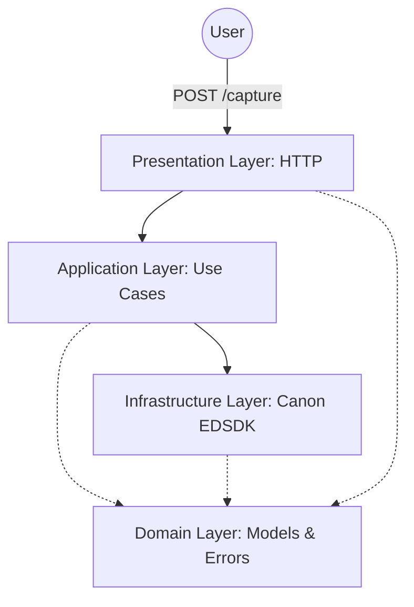
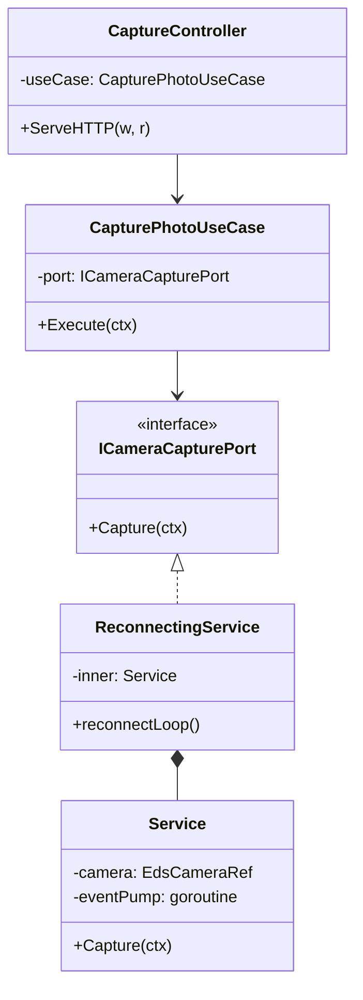
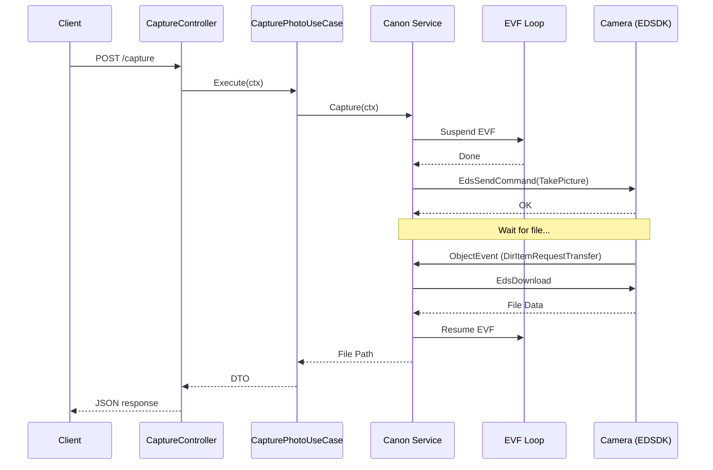
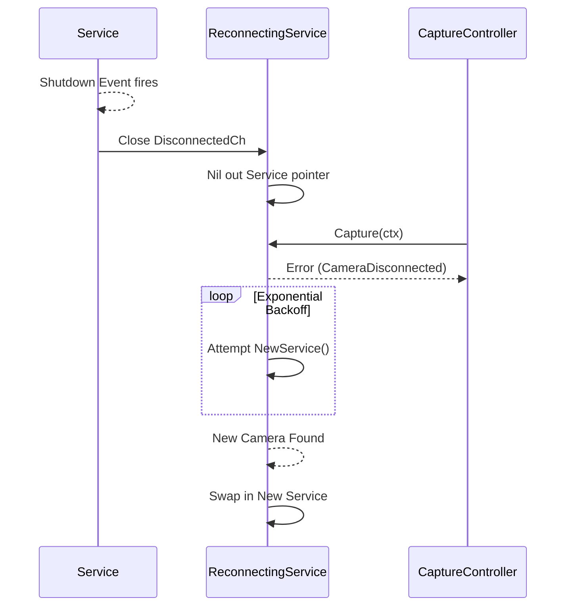

# System Architecture

This document describes the architecture of the **Photoboot-Picstop** backend, which interfaces with Canon cameras via
the EDSDK.

## Architecture Overview

The system follows a clean, layered architecture with a clear separation of concerns, ensuring that the business logic (
Application) is isolated from external frameworks or hardware drivers (Infrastructure).

### Layer Responsibilities

- **Presentation (HTTP)**: Handles RESTful requests, parses input (e.g., `timeout_ms`), and maps domain errors to
  appropriate HTTP status codes. It uses a View Model pattern to decouple internal domain types from external JSON
  responses.
- **Application**: Contains the business orchestration logic. It defines **ports** (interfaces) like
  `ICameraCapturePort` that the infrastructure layer must implement. This layer ensures that use cases (e.g.,
  `CapturePhotoUseCase`) remain agnostic of the underlying camera driver.
- **Infrastructure (Canon)**: The "heavy lifting" layer. Implements camera control using CGo and the Canon EDSDK. It
  manages the `ReconnectingService` wrapper, COM STA threading, and the callback-driven event pump.
- **Domain**: Pure Go logic containing value objects and sentinel errors.
    - `CaptureResult`: Value object representing the outcome of a capture.
    - Sentinel Errors: `ErrCaptureInProgress`, `ErrCaptureSuperseded`, `ErrShutterCommandTimeout`,
      `ErrCameraDisconnected`.

---

## Component Interaction

The interaction between components is managed through dependency injection, wired together in `cmd/server/main.go`.

---

## Specialized EDSDK Handling

The Canon EDSDK has strict requirements that influence the system's design:

### 1. COM STA & Threading

The EDSDK requires every thread that calls its functions to be initialized as a **Single Threaded Apartment (STA)**.

- Each specialized goroutine (Event Pump, EVF Loop) initializes COM STA locally.
- Global EDSDK initialization/termination is reference-counted to allow service restarts.

### 2. Event Pump

The EDSDK is event-driven for object creation (files) and state changes (disconnects). A dedicated event pump goroutine
runs `EdsGetEvent()` in a loop to ensure these callbacks are processed.

### 3. EVF / Capture Synchronization

Capturing a photo and running the Live View (EVF) cannot always happen concurrently on some Canon models, or may cause
race conditions in the SDK.

- The `Service` automatically **suspends** the EVF loop before firing the shutter.
- It **resumes** the EVF loop only after the file download is complete and no other captures are pending.

---

## Sequence Flows

### Photo Capture Flow

This diagram illustrates the end-to-end flow of a capture request, including the internal suspension of the EVF.

### Camera Reconnection Flow

The `ReconnectingService` ensures the system recovers gracefully from physical disconnections.

---

## Configuration & API

The system is configured via environment variables. These settings tune the timing and behavior of the EDSDK interface.
Detailed API specifications can be found in the [openapi.yaml](./openapi.yaml) file.

| Variable                           | Default    | Description                                  |
|------------------------------------|------------|----------------------------------------------|
| `PORT`                             | `8080`     | HTTP listen port                             |
| `CAPTURE_DIR`                      | `captures` | Directory where photos are saved on the host |
| `CAPTURE_TIMEOUT_MS`               | `60000`    | Overall timeout for a capture HTTP request   |
| `CANON_DISCOVERY_TIMEOUT_MS`       | `20000`    | Timeout for finding the camera on startup    |
| `CANON_SHUTTER_COMMAND_TIMEOUT_MS` | `45000`    | Timeout for the initial shutter fire command |
| `CANON_JOB_DRAIN_TIMEOUT_MS`       | `4000`     | Wait time for previous camera jobs to finish |
| `CANON_CAPTURE_PREEMPT_MS`         | `1200`     | Delay after preempting an in-flight capture  |

---

## Build & Environment

This project is a Windows-specific Go application because it uses the Canon EDSDK DLLs.

- **OS**: Windows (Required for `EDSDK.dll`).
- **Compiler**: GCC (e.g., via Scoop or MinGW) is required for CGo support.
- **CGo**: Must be enabled (`CGO_ENABLED=1`).
- **Binaries**: `edsdk/EDSDK.dll` and `edsdk/EDSDK.lib` must be present in the expected paths for linking and runtime.
