# **Canon EDSDK Documentation Transcription**


## **2.4 EDSDK Objects**

As shown in Figure 2-3, EDSDK employs a hierarchical structure with a camera list at the root in order to control and access cameras connected to the host PC. This hierarchical structure consists of the following elements: camera list, cameras, volumes, folders, image files, audio files, etc.  
These elements are treated as belonging to one of the following object categories: EdsCameraListRef, EdsCameraRef, EdsVolumeRef, and EdsDirectoryItemRef. Having a hierarchical structure, these four objects may have child objects.

### **Figure 2-3 Hierarchical Structure of EDSDK Objects**
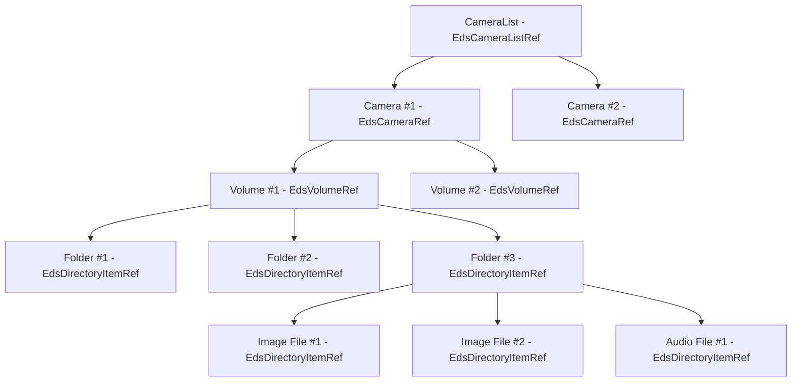
Although the four objects shown above are used to access connected cameras, on an image file is transferred to the host PC, the object used to control that image changes even if it is the same image file.  
As shown in Figure 2-4 below, the EdsStreamRef object is used to control input/output when transferring images from the camera to the host. Then EdsImageRef is used to control the image file transferred to the host. This is due to the fact that operations differ for an image file is stored in the camera versus an image file stored on the host.

### **Figure 2-4 Changes in Controlled Objects**
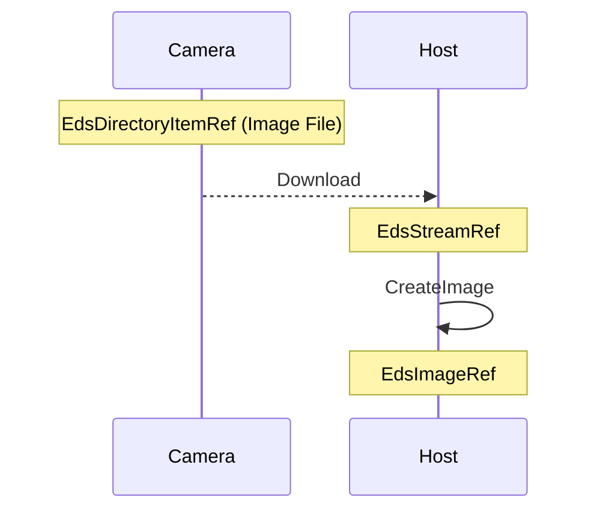
### **Object Descriptions**

1. **EdsCameraListRef**: This object represents an enumeration of the cameras remotely connected to the host PC by USB interface. This object can be used to select the camera to be controlled from among the cameras currently connected with EDSDK client application. This object can also be used when getting an EdsCameraRef child object.
2. **EdsCameraRef**: This object represents a remotely connected camera. This object is used to control the camera or to get an EdsVolumeRef object when accessing the memory card, which is a child object of the camera.
3. **EdsVolumeRef**: This object represents the memory card inside the camera. If the camera model allows two memory cards to be installed at once, the EdsVolumeRef object represents one memory card each. This object is used to get an EdsDirectoryItemRef object, which is a child object, when performing operations on a file or folder on the memory card.
4. **EdsDirectoryItemRef**: This object represents a file or folder on the camera. When files are downloaded from the camera, each file to be downloaded is treated as one of these objects.
5. **EdsImageRef**: This object represents image data. This data is obtained from image files. This object is used to retrieve and control information included with an image such as thumbnails and parameters.
6. **EdsStreamRef**: This object represents the file I/O stream. An open stream on the host PC can be specified as the download destination when downloading files in the camera to the host PC. Streams are also used when loading image files stored on the storage media of the host PC into an EDSDK client application. Furthermore, EdsStreamRef objects can also be created in memory.
7. **EdsEvfImageRef**: This object represents PC live view image data. When using a camera model that supports live view, live view image data set can be downloaded from the camera. Information such as zoom and histogram data is included with image data.

## **2.5 Object Management**

### **2.5.1 Object Management Using a Reference Counter**

Applications built using the EDSDK carry out object management using a reference counter.  
EDSDK stores a reference counter for all objects. The reference counter is set to 1 when an object has been allocated. The developer increases the reference counter by 1 at the point that the object is required by the program, and lowers it by 1 when the object is no longer needed. When a reference counter reaches 0, the associated object is automatically deleted by the EDSDK. The developer must, therefore, explicitly declare that an object is being referred when it is required by the program. EdsRetain and EdsRelease are provided as APIs for controlling object reference counters.

### **2.5.2 Releasing Resources when Exiting the Library**

Applications built using the EDSDK will release all allocated resources when EdsTerminateSDK is called.

## **2.6 Properties**

Properties are stored under EDSDK for camera and image objects. For example, properties may represent values such as camera Av and Tv. The functions **EdsGetPropertyData** and **EdsSetPropertyData** are used to get and set these properties. Since this API takes objects of undefined type as arguments, the properties that can be retrieved or set differ depending on the given object. In addition, some properties have a list of currently settable values. **EdsGetPropertyDesc** is used to get this list of settable values.

### **Figure 2-5 Example of Object Properties**
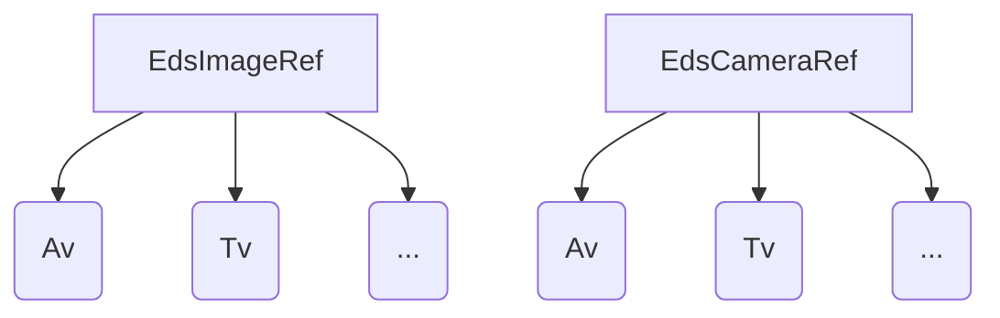
## **2.7 Camera Status**

Cameras remotely connected to the host PC can be in one of several states: UI lock, UI lock release, direct transfer, and direct transfer release.

1. **UI Lock**: In this state, all operations of the camera unit are disabled and only operations from the host PC are accepted. This allows data and instructions to be safely sent from the host PC to the camera.
2. **UI Lock Release**: In this state, operations of the camera unit are enabled. Although data and instructions can be sent from the host PC to the camera in this state, conflicts may arise.
3. **Direct Transfer (for models with an Easy Direct button)**: In this state, the camera is currently directly transferring data. Available camera operations are limited to those functions related to the direct transfer. It is possible to send instructions from the PC to the camera in this state. A direct transfer request event notification (kEdsObjectEvent_DirItemRequestTransferDT) is issued to the EDSDK client application connected to the camera when an operation for starting image download is initiated using camera controls. The EDSDK client application receives this event and begins processing for downloading images from the camera.
4. **Direct Transfer Release**: This state indicates that direct transfer is not currently being carried out.

### **Figure 2-6 Camera State Transitions**
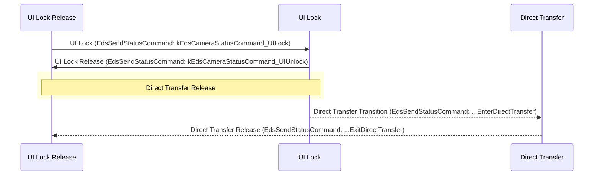

## **2.8 Asynchronous Events**

An asynchronous event is a mechanism used to issue notifications from the EDSDK to the application regarding cameras connected to the host PC or state changes that have occurred for a camera. For example, if a state change occurs where a camera’s shooting mode changes and a new image that needs to be transferred to the PC has been shot, a notification of that fact is sent to the application regardless of its state (asynchronously).  
An event handler capable of the specific processing required for a particular event must be registered in order to receive such an event (notification). An event handler is a user function called when an event is received. Event handlers are also referred to as “callback functions.” Users can allow events to be accepted by creating and registering callback functions that accept events issued by EDSDK.

### **Figure 2-7 Example of a Camera Operation-Based Event Notification**
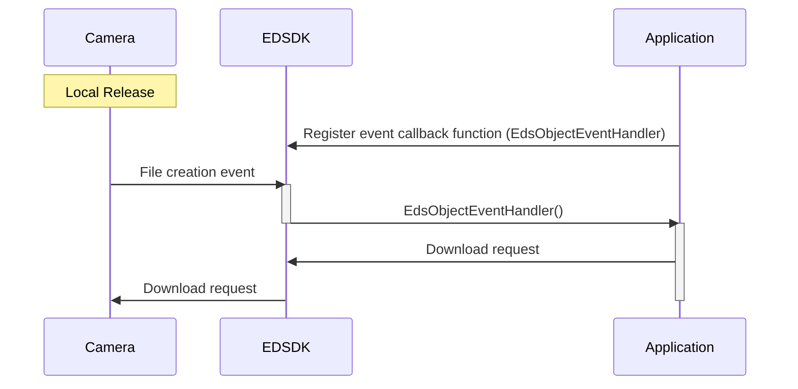
### **Figure 2-8 Host PC Operation-Related Event Notification**
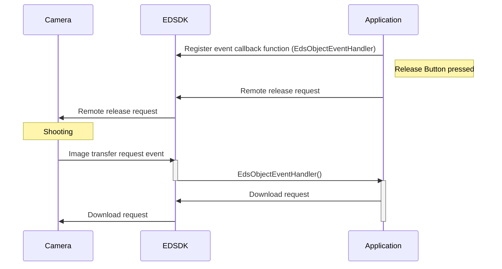
### **Event Processing Details**

When an event occurs, the EDSDK executes the callback function registered by the user. The callback function is executed on the thread that established a session with the camera and takes information depending on the event type as arguments (as specified by the event ID).  
The user must release objects as they become unneeded.  
There are three types of events issued from the EDSDK to a client application: object-related events, property-related events, and state-related events.

1. **Object-related events**: This is the group of events where request notifications are issued to create, delete or transfer image data stored in a remotely connected camera (in memory) or image files on the memory card.  
2. **Property-related events**: This is the group of events where notifications are issued regarding changes in the properties of a remotely connected camera.  
3. **State-related events**: This is the group of events where notifications are issued regarding changes in the state of a remotely connected camera, such as the activation of a shut-down timer.

For details on event information and the role events play, see the section *Asynchronous Events*.

## **2.9 Initializing and Terminating the Library**

The user must initialize the EDSDK library in order to use EDSDK functions other than those for getting device information from a camera. The user must also terminate the library when EDSDK functions are no longer needed.  
Be sure to execute initialization and termination of the library once each within the application process.

### **Figure 2-9 Initialization and Termination**
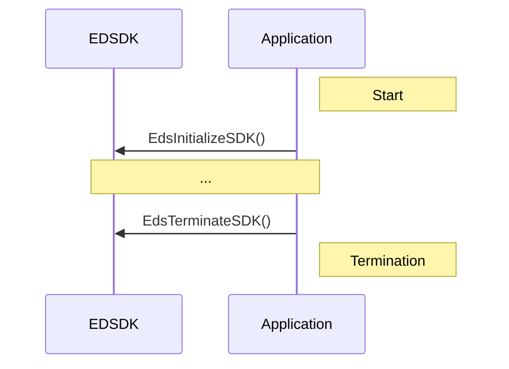
## **2.10 Accessing a Camera**

The EDSDK provides methods of accessing and controlling a camera. In order to allow more than one camera connected to the host PC by USB or other means, it is possible to get all camera objects by repeatedly calling **EdsGetChildAtIndex** by specifying an index of child objects on the camera list.  
The number of cameras connected can be obtained using **EdsGetChildCount**. Specify 0 as the index passed to **EdsGetChildAtIndex** if there is only one camera.  
EDSDK client application can open a session with any one of the connected cameras. Opening a session means connecting to a camera at the application level so that it is possible to control that camera from the application and get associated properties and events. To open a session, specify the camera in question and call **EdsOpenSession**. Open sessions must be closed using **EdsCloseSession** when communications are finished.

### **Camera Access Sequence**
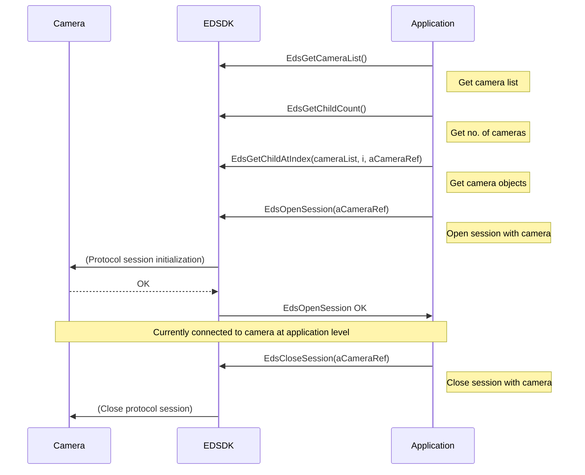
## **Notes on Developing Windows Applications**

When creating applications that run under Windows, a COM initialization is required for each thread in order to access a camera from a thread other than the main thread.  
To create a user thread and access the camera from that thread, be sure to execute **CoInitializeEx( NULL, COINIT\_APARTMENTTHREADED )** at the start of the thread and **CoUninitialize()** at the end.  
Sample code is shown below. This is the same when controlling EdsVolumeRef or EdsDirectoryItemRef objects from another thread, not just with EdsCameraRef.

```cpp
void TakePicture(EdsCameraRef camera)  
{  
    // Executed by another thread  
    HANDLE hThread \= (HANDLE)\_beginthread(threadProc, 0, camera);  
    // Block until finished  
    ::WaitForSingleObject( hThread, INFINITE );  
}

void threadProc(void\* lParam)  
{  
    EdsCameraRef camera \= (EdsCameraRef)lParam;  
      
    CoInitializeEx( NULL, COINIT\_APARTMENTTHREADED );  
      
    EdsSendCommand(camera, kEdsCameraCommand\_PressShutterButton,   
                   kEdsCameraCommand\_ShutterButton\_Completely);  
                     
    EdsSendCommand(camera, kEdsCameraCommand\_PressShutterButton,   
                   kEdsCameraCommand\_ShutterButton\_OFF);  
                     
    CoUninitialize();  
      
    \_endthread();  
}
```

## **Notes on Developing Macintosh Applications**

On macOS 13 (Ventura) or later, the number of cameras may be returned as 0 when getting the camera list. In such cases, try runloop processing before getting the camera list. Refer to the samples in the appendix (Swift and Objective-C) for details.

## **2.11 Transferring Files in the Camera**

This section describes how to access files in the camera and transfer them to the host PC.  
Although it is possible to access the camera and control the properties of files (such as the date of creation and protection settings), it is not possible to analyze file properties. Files must therefore be transferred in order to get file properties. A method for transferring thumbnails (header information) only is also provided for such cases.

### **Figure 2-11 Transfer of Files in Camera**
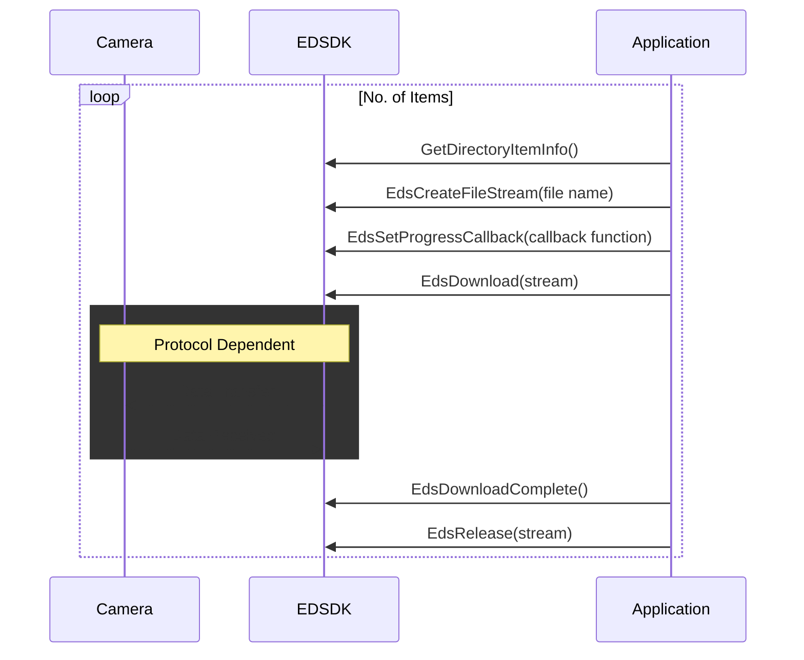


## **2.12 Transferring Captured Images**

When a shoot command is sent from the host PC to the camera, the camera will record the image shot in a buffer inside the camera. Once the shot has been taken, the callback function set using **EdsSetPropertyEventHandler**, **EdsSetObjectEventHandler**, and **EdsSetCameraStateEventHandler** will be called by the EDSDK. The user must sequentially transfer the images stored in the camera buffer to the host PC.

### **Figure 2-12 Capture Image Transfer**
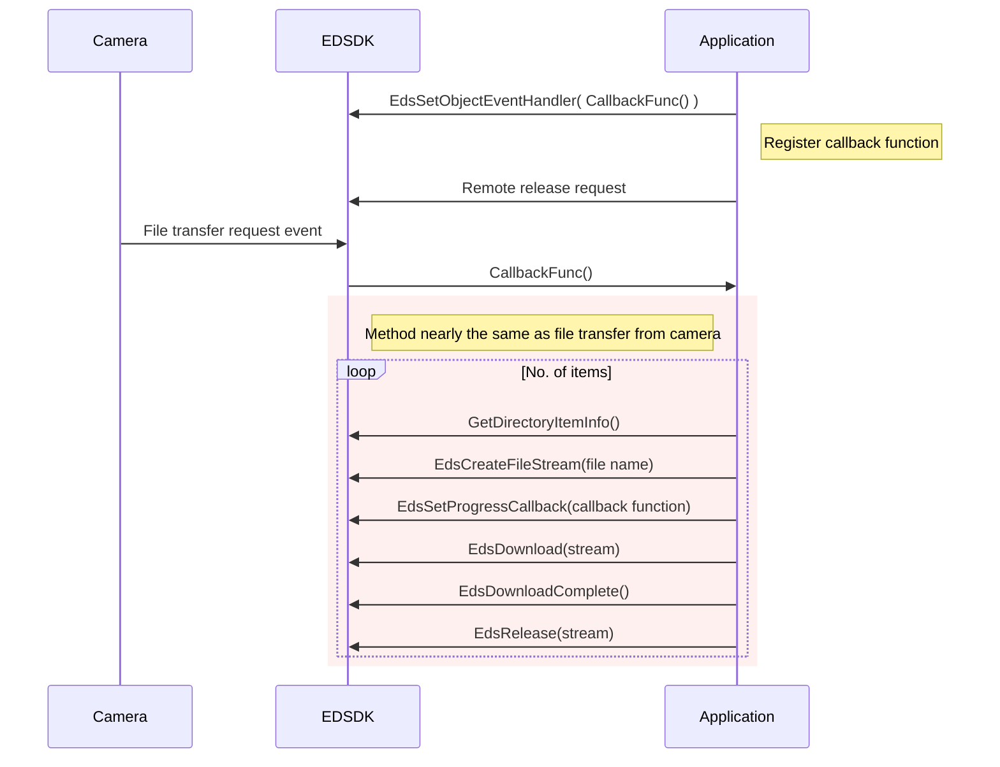
## **2.13 Handling Image Objects**

### **2.13.1 Overview**

As touched on in the section on EDSDK objects, it is impossible to get an image object reference from an image file stored in a camera. An image object reference can only be obtained after first downloading the image file to a host PC.  
An image object is an object that has properties. Camera properties such as Tv and Av that are used while shooting images are stored and can be obtained using **EdsGetPropertyData**.

### **2.13.2 Getting and Setting Properties**

### **Figure 2-13 Getting an Image Object and Its Properties**
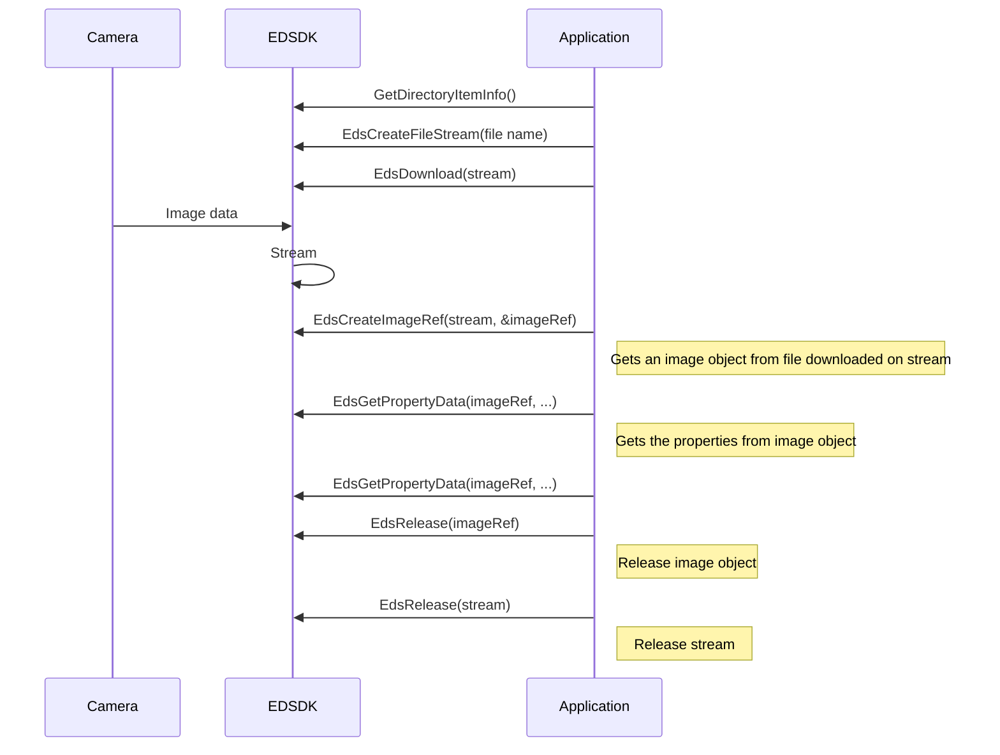
## **2.14 Basic Data Type Definitions**

This section introduces the basic data types used under the EDSDK. These data types are defined as C language types.
```cpp
typedef void           EdsVoid;  
typedef int            EdsBool;

typedef char           EdsChar;  
typedef char           EdsInt8;  
typedef unsigned char  EdsUint8;  
typedef short          EdsInt16;  
typedef unsigned short EdsUint16;  
typedef long           EdsInt32;  
typedef unsigned long  EdsUint32;

#ifdef __MACOS__  
#ifdef __cplusplus  
    typedef long long          EdsInt64;  
    typedef unsigned long long EdsUint64;  
#else  
    typedef SInt64             EdsInt64;  
    typedef UInt64             EdsUint64;  
#endif  
#else  
    typedef __int64            EdsInt64;  
    typedef unsigned __int64   EdsUint64;  
#endif

typedef float          EdsFloat;  
typedef double         EdsDouble;
```
## **2.15 EDSDK Errors**

Most of the APIs supplied by EDSDK return an error code of type EdsError as their return value.  
The return value of an API that terminates normally is EDS_ERR_OK. If an error occurs, the return value of the API in question is set to the error code indicating the root cause of the error and any passed parameters are stored as undefined values. (Note that an API used to control files is not limited to returning an error related to file control.)  
For error codes, see the list given in the header file EdsError.h or see EDS ERROR Lists at the end of the section describing APIs in this document.


## **6.3 Sample Code**

This sample code is written in C++.

### **6.3.1 SAMPLE1 From initializing to finalizing**

```c++
void applicationRun()  
{  
EdsError err = EDS_ERR_OK;  
EdsCameraRef camera = NULL;  
bool isSDKLoaded = false;  
// Initialize SDK  
err = EdsInitializeSDK();  
if(err == EDS_ERR_OK)  
{  
    isSDKLoaded = true;  
}

// Get first camera  
if(err == EDS_ERR_OK)  
{  
    // See Sample 2.  
    err = getFirstCamera (&camera);  
}

// Set Object event handler  
if(err == EDS_ERR_OK)  
{  
    err = EdsSetObjectEventHandler(camera, kEdsObjectEvent_All,   
                                    handleObjectEvent, NULL);  
}

// Set Property event handler  
if(err == EDS_ERR_OK)  
{  
    err = EdsSetPropertyEventHandler(camera, kEdsPropertyEvent_All,   
                                      handlePropertyEvent, NULL);  
}

// Set State event handler  
if(err == EDS_ERR_OK)  
{  
    err = EdsSetCameraStateEventHandler(camera, kEdsStateEvent_All,   
                                         handleStateEvent, NULL);  
}

// Open session with camera  
if(err == EDS_ERR_OK)  
{  
    err = EdsOpenSession(camera);  
}

/////  
// do something  
////

// Close session with camera  
if(err == EDS_ERR_OK)  
{  
    err = EdsCloseSession(camera);  
}

// Release camera  
if(camera != NULL)  
{  
    EdsRelease(camera);  
}

// Terminate SDK  
if(isSDKLoaded)  
{  
    EdsTerminateSDK();  
}

}  
EdsError EDSCALLBACK handleObjectEvent( EdsObjectEvent event,  
EdsBaseRef object,  
EdsVoid * context)  
{  
// do something  
/*  
switch(event)  
{  
    case kEdsObjectEvent_DirItemRequestTransfer:  
        downloadImage(object);  
        break;

    default:  
        break;  
}  
*/

// Object must be released  
if(object)  
{  
    EdsRelease(object);  
}

}  
EdsError EDSCALLBACK handlePropertyEvent (EdsPropertyEvent event,  
EdsPropertyID property,  
EdsVoid * context)  
{  
// do something  
}  
EdsError EDSCALLBACK handleStateEvent (EdsCameraStateEvent event,  
EdsUInt32 parameter,  
EdsVoid * context)  
{  
// do something  
}
```

### **6.3.2 SAMPLE2 Getting a camera object**

```c++
EdsError getFirstCamera(EdsCameraRef *camera)  
{  
EdsError err = EDS_ERR_OK;  
EdsCameraListRef cameraList = NULL;  
EdsUInt32 count = 0;  
// Get camera list  
err = EdsGetCameraList(&cameraList);

// Get number of cameras  
if(err == EDS_ERR_OK)  
{  
    err = EdsGetChildCount(cameraList, &count);  
    if(count == 0)  
    {  
        err = EDS_ERR_DEVICE_NOT_FOUND;  
    }  
}

// Get first camera retrieved  
if(err == EDS_ERR_OK)  
{  
    err = EdsGetChildAtIndex(cameraList, 0, camera);  
}

// Release camera list  
if(cameraList != NULL)  
{  
    EdsRelease(cameraList);  
    cameraList = NULL;  
}

return err;

}
```

### **6.3.3 SAMPLE3 Getting a property**

```c++
EdsError getTv(EdsCameraRef camera, EdsUInt32 *Tv)  
{  
EdsError err = EDS_ERR_OK;  
EdsDataType dataType;  
EdsUInt32 dataSize;  
err = EdsGetPropertySize(camera, kEdsPropID_Tv, 0, &dataType, &dataSize);

if(err == EDS_ERR_OK)  
{  
    err = EdsGetPropertyData(camera, kEdsPropID_Tv, 0, dataSize, Tv);  
}

return err;

}
```

### **6.3.4 SAMPLE4 Getting a propertydesc**

```c++
EdsError getTvDesc(EdsCameraRef camera, EdsPropertyDesc *TvDesc)  
{  
EdsError err = EDS_ERR_OK;  
err = EdsGetPropertyDesc(camera, kEdsPropID_Tv, TvDesc);

return err;

}
```

### **6.3.5 SAMPLE5 Setting a property**

```c++
EdsError setTv(EdsCameraRef camera, EdsUInt32 TvValue)  
{  
EdsError err = EDS_ERR_OK;  
err = EdsSetPropertyData(camera, kEdsPropID_Tv, 0, sizeof(TvValue), &TvValue);

return err;

}
```

### **6.3.6 SAMPLE6 Downloading an image**

```c++
EdsError downloadImage(EdsDirectoryItemRef directoryItem)  
{  
EdsError err = EDS_ERR_OK;  
EdsStreamRef stream = NULL;  
// Get directory item information  
EdsDirectoryItemInfo dirItemInfo;  
err = EdsGetDirectoryItemInfo(directoryItem, &dirItemInfo);

// Create file stream for transfer destination  
if(err == EDS_ERR_OK)  
{  
    err = EdsCreateFileStream( dirItemInfo.szFileName,   
                               kEdsFile_CreateAlways,   
                               kEdsAccess_ReadWrite, &stream);  
}

// Download image  
if(err == EDS_ERR_OK)  
{  
    err = EdsDownload( directoryItem, dirItemInfo.size, stream);  
}

// Issue notification that download is complete  
if(err == EDS_ERR_OK)  
{  
    err = EdsDownloadComplete(directoryItem);  
}

// Release stream  
if( stream != NULL)  
{  
    EdsRelease(stream);  
    stream = NULL;  
}

return err;

}
```

### **6.3.7 SAMPLE7 Getting a file object**

```c++
EdsError getVolume(EdsCameraRef camera, EdsVolumeRef* volume)  
{  
EdsError err = EDS_ERR_OK;  
EdsUInt32 count = 0;  
// Get the number of camera volumes  
err = EdsGetChildCount(camera, &count);  
if(err == EDS_ERR_OK && count == 0)  
{  
    err = EDS_ERR_DIR_NOT_FOUND;  
}

// Get initial volume  
if(err == EDS_ERR_OK)  
{  
    err = EdsGetChildAtIndex(camera, 0, volume);  
}

return err;

}
```

### **6.3.8 SAMPLE8 Getting DCIM Folder**

```c++
EdsError getDCIMFolder(EdsVolumeRef volume, EdsDirectoryItemRef* directoryItem)  
{  
EdsError err = EDS_ERR_OK;  
EdsDirectoryItemRef dirItem = NULL;  
EdsDirectoryItemInfo dirItemInfo;  
EdsUInt32 count = 0;  
// Get number of items under the volume  
err = EdsGetChildCount(volume, &count);  
if(err == EDS_ERR_OK && count == 0)  
{  
    err = EDS_ERR_DIR_NOT_FOUND;  
}

// Get DCIM folder  
for(int i = 0; i < count && err == EDS_ERR_OK; i++)  
{  
    // Get the ith item under the specified volume  
    if(err == EDS_ERR_OK)  
    {  
        err = EdsGetChildAtIndex(volume, i, &dirItem);  
    }

    // Get retrieved item information  
    if(err == EDS_ERR_OK)  
    {  
        err = EdsGetDirectoryItemInfo(dirItem, &dirItemInfo);  
    }

    // Indicates whether or not the retrieved item is a DCIM folder.  
    if(err == EDS_ERR_OK)  
    {  
        if(_stricmp (dirItemInfo.szFileName, "DCIM") == 0 &&   
           dirItemInfo.isFolder == true)  
        {  
            *directoryItem = dirItem;  
            break;  
        }  
    }

    // Release retrieved item  
    if(dirItem)  
    {  
        EdsRelease(dirItem);  
        dirItem = NULL;  
    }  
}

return err;

}

### **6.3.9 SAMPLE9 Taking a picture**

EdsError takePicture(EdsCameraRef camera)  
{  
EdsError err;  
err = EdsSendCommand(camera, kEdsCameraCommand_PressShutterButton,   
                      kEdsCameraCommand_ShutterButton_Completely);

err = EdsSendCommand(camera, kEdsCameraCommand_PressShutterButton,   
                      kEdsCameraCommand_ShutterButton_OFF);

return err;

}
```

### **6.3.10 SAMPLE10 Live view**

```c++
EdsError startLiveview(EdsCameraRef camera)  
{  
EdsError err = EDS_ERR_OK;  
// Get the output device for the live view image  
EdsUInt32 device;  
err = EdsGetPropertyData(camera, kEdsPropID_Evf_OutputDevice, 0, sizeof(device), &device );

// PC live view starts by setting the PC as the output device for the live view image.  
if(err == EDS_ERR_OK)  
{  
    device |= kEdsEvfOutputDevice_PC;  
    err = EdsSetPropertyData(camera, kEdsPropID_Evf_OutputDevice, 0, sizeof(device), &device);  
}

// A property change event notification is issued from the camera if property settings are made successfully.  
// Start downloading of the live view image once the property change notification arrives.

return err;

}  
EdsError downloadEvfData(EdsCameraRef camera)  
{  
EdsError err = EDS_ERR_OK;  
EdsStreamRef stream = NULL;  
EdsEvfImageRef evfImage = NULL;

// Create memory stream.  
err = EdsCreateMemoryStream( 0, &stream);

// Create EvfImageRef.  
if(err == EDS_ERR_OK)  
{  
    err = EdsCreateEvfImageRef(stream, &evfImage);  
}

// Download live view image data.  
if(err == EDS_ERR_OK)  
{  
    err = EdsDownloadEvfImage(camera, evfImage);  
}

// Get the incidental data of the image.  
if(err == EDS_ERR_OK)  
{  
    // Get the zoom ratio  
    EdsUInt32 zoom;  
    EdsGetPropertyData(evfImage, kEdsPropID_Evf_ZoomPosition, 0, sizeof(zoom), &zoom);

    // Get the focus and zoom border position  
    EdsPoint point;  
    EdsGetPropertyData(evfImage, kEdsPropID_Evf_ZoomPosition, 0, sizeof(point), &point);  
}

//  
// Display image  
//

// Release stream  
if(stream != NULL)  
{  
    EdsRelease(stream);  
    stream = NULL;  
}

// Release evfImage  
if(evfImage != NULL)  
{  
    EdsRelease(evfImage);  
    evfImage = NULL;  
}

return err;

}  
EdsError endLiveview(EdsCameraRef camera)  
{  
EdsError err = EDS_ERR_OK;  
// Get the output device for the live view image  
EdsUInt32 device;  
err = EdsGetPropertyData(camera, kEdsPropID_Evf_OutputDevice, 0, sizeof(device), &device );

// PC live view ends if the PC is disconnected from the live view image output device.  
if(err == EDS_ERR_OK)  
{  
    device &= ~kEdsEvfOutputDevice_PC;  
    err = EdsSetPropertyData(camera, kEdsPropID_Evf_OutputDevice, 0, sizeof(device), &device);  
}

return err;

}
```

## **6.4 Steps to begin/end movie shooting remotely**

Unlike in the case of still image shooting, we cannot transfer a movie file stored on camera's memory directly to PC.
The movie file will be recorded to the inserted memory card in the camera. So memory card must be inserted to the camera
to shoot a movie.  
Please follow the following steps to be ready to begin/end movie shooting remotely.

### **6.4.1 Set camera as the destination to save file**

To prepare to shoot movie, you must set camera as the destination to save file.

```c++
EdsUInt32 saveTo = kEdsSaveTo_Camera;  
err = EdsSetPropertyData(cameraRef, kEdsPropID_SaveTo, 0, sizeof(saveTo), &saveTo);
```

### **6.4.2 Set the camera to movie shooting mode**

\<Movie shooting switch supported camera>  
Camera which has Movie shooting switch or Movie shooting mode in the mode dial, set the switch or dial to the movie
shooting mode. Then the Live View will automatically start and the camera will be ready to shoot movie.  
\<Movie shooting switch unsupported camera>  
Camera which doesn't have Movie shooting switch or Movie shooting mode in the mode dial, enable movie recording in the
Live View settings. Then if you start remote Live View like in the case of still image shooting the Live View will start
in movie shooting mode.

### **6.4.3 Begin/End movie shooting**

You can begin/end movie shooting with the following operations.

```c++
EdsUInt32 record_start = 4; // Begin movie shooting  
err = EdsSetPropertyData(cameraRef, kEdsPropID_Record, 0, sizeof(record_start), &record_start);  
EdsUInt32 record_stop = 0; // End movie shooting  
err = EdsSetPropertyData(cameraRef, kEdsPropID_Record, 0, sizeof(record_stop), &record_stop);
```

### **6.4.4 To get movie file**

Once the movie file is created in the memory card, the kEdsObjectEvent_DirItemCreated event will be published and the
EdsDirectoryItemRef of the movie file will be noticed from the camera.  
After you end movie shooting mode, you can download the movie file to your PC using EdsDirectoryItemRef, which has been
noticed by the camera, by following the steps written in "6.3.6 SAMPLE6 Downloading an image."